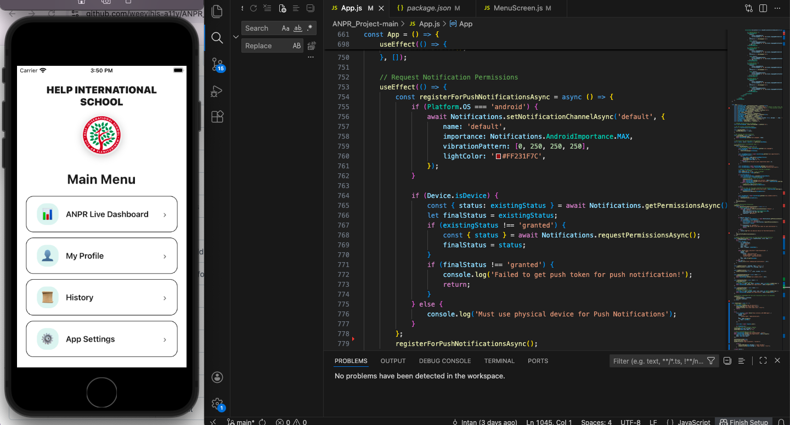
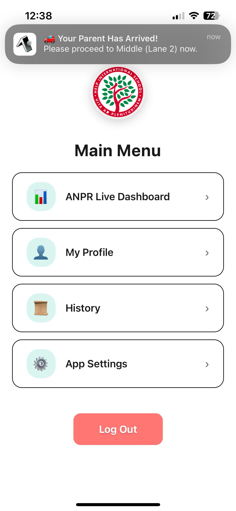

# 🚗 ANPR School Pickup System

## 📌 Overview
The **ANPR (Automatic Number Plate Recognition) School Pickup System** is a mobile-based application designed to improve the efficiency and safety of student pickup at school.

This system detects vehicle number plates and automatically notifies students when their parent/guardian has arrived at the pickup area.

---

## 🎯 Purpose
The goal of this project is to:
- Reduce congestion during school pickup hours  
- Improve communication between parents and students  
- Automate manual verification processes using technology  

---

## 📱 Features

### 🔐 Authentication
- Login using **school email only**
- Secure user verification system

### 🚗 Live Detection Dashboard
- Displays real-time detected vehicle data  
- Shows:
  - Student Name  
  - Lane ID  
  - Detection Time  

### 🔔 Notifications
- Instant in-app notification when a vehicle is detected  
- Push notification support (Expo)

### 📜 History Log
- Stores recent pickup activity  
- Search and filter functionality  

### ⚙️ Settings
- Dark Mode support 🌙  
- Multi-language support:
  - English  
  - Chinese  
  - Korean  
  - Malay  

### 👤 Profile
- User information management  

---

## 🛠️ Tech Stack

### Frontend (Mobile App)
- React Native (Expo)

### Backend
- Node.js (Express)
- MySQL Database

### Other Tools
- Expo Notifications  
- AsyncStorage  

---

## 🧠 How It Works

1. User logs in using a school email  
2. System verifies user via backend  
3. When a vehicle is detected:
   - Plate number is matched with database  
   - Student is identified  
   - Notification is sent to the mobile app  
4. Activity is recorded in the history log  

---
## How to Run
Make sure have these installed:
- [Node.js](https://nodejs.org) (v18 or above)
- [Expo Go](https://expo.dev/go) app on your phone
- Must be connected to **school WiFi** (to access the database)

### Install app dependencies
```
npm install
```
### Set up backend server
Install backend dependencies:
```
npm install express mysql2 nodemailer cors dotenv
```

Start the backend server:
```bash
node server.js
```
You should see:

🚀 Server running on http://localhost:3000

✅ MySQL Connected

### Find your Mac/PC local IP address

**Mac:**
```bash
ipconfig getifaddr en0
```

**Windows:**
```bash
ipconfig
```
Look for **IPv4 Address** under your WiFi adapter.

### Update the server URL in the app

Open `App.js` file and find this line:
```javascript
const response = await fetch("http://10.xxx.2.xxx:3000/login"
```
Replace `10.xxx.2.xxx` with your own IP address.

### Start the app
```bash
npx expo start
```

Scan the QR code with your phone's camera (iOS) or Expo Go (Android).

---
## Role Detection

The app automatically detects the user role based on their school email:

| Email Format | Role |
|---|---|
| `123abc@kl.his.edu.my` | Student |
| `name.surname@kl.his.edu.my` | Staff |

---

## Notification 

| Who | What they receive |
|---|---|
| **Staff** | All student pickup alerts + second round warnings |
| **Student** | Only their own pickup notification. Show up message to hurry to pickup zone if takes second round |

---

##  Notes
- The backend server must be running for login and notifications to work
- Both your phone and laptop must be on the **same WiFi network**
- The school database is only accessible on **school WiFi**
  
## 📂 Project Structure
### Login Page


### Menu Page

